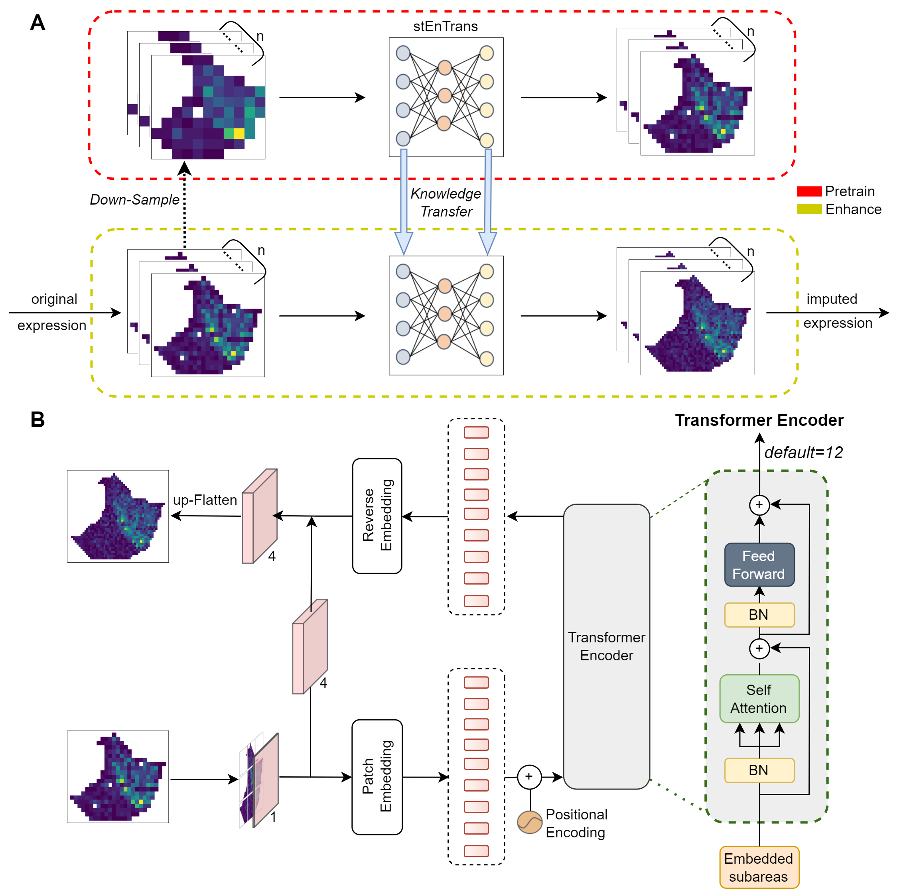

# stEnTrans: Transformer-based deep learning for spatial transcriptomics enhancement
## Introduction
Spatial transcriptomics (ST) technology aims to detect the quantity of gene transcripts within tissues while preserving spatial location information. But current popular spatial transcriptomics techniques either have shallow sequencing depth or low resolution. This software package implements **stEnTrans** (spatial transcriptomics enhancement based on Transformer architecture), a deep learning method based on **Transformer** architecture that provides comprehensive predictions for gene expression in unmeasured areas or unexpectedly lost areas and enhances gene expression in all spots by **self-supervised learning (SSL)**, thereby improving the resolution of gene expression profiles. On the whole, stEnTrans can help discover the spatial structure of genes and enrich more biologically significant pathways by enhancing the resolution of gene expression profiles.
{width="50%"}
## Installations
- Windows
- NVIDIA GPU (a single Nvidia GeForce RTX 3090)
- `pip install -r requiremnts.txt`
## Get Started
To run the demo of ST data, you can : `python human_melanoma_ST_data.py`
To run the demo of 10X Visium data, you can : `python Human_Invasive_Ductal_Carcinoma_10X_data.py`
If you want to evaluate PCCs (Pearson Correlation Coefficients), you can : `PCCs/main.py`
